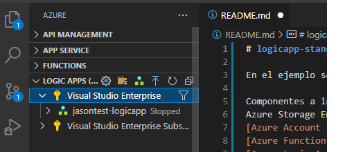
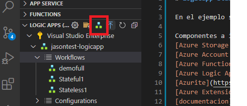
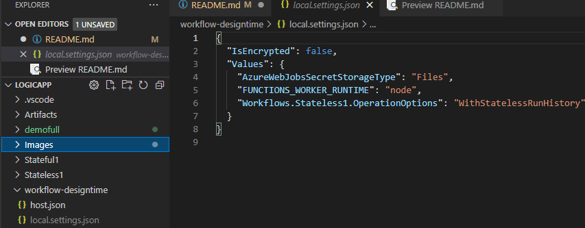
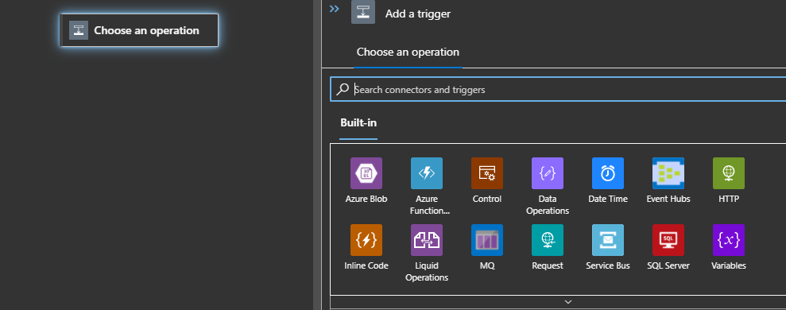
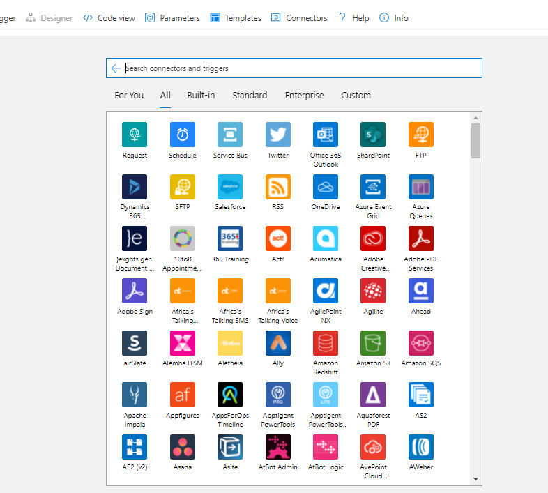
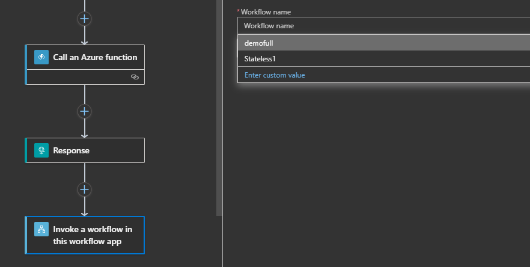

# logicapp-standard

En el ejemplo se hace uso de funciones stateless y stateful

Componentes a instalar:
[Azure Storage Emulator]()
[Azure Account Extention](https://marketplace.visualstudio.com/items?itemName=ms-vscode.azure-account)
[Azure Function core](https://github.com/Azure/azure-functions-core-tools/releases/tag/3.0.3477)
[Azure Logic Apps (standard) extention](https://go.microsoft.com/fwlink/p/?linkid=2143167)
[Azurite](https://www.npmjs.com/package/azurite)
[Azure Extension]()
[documentacion](https://docs.microsoft.com/en-us/azure/logic-apps/single-tenant-overview-compare) Aca se encuentra toda la informacion para el manejo de la herramienta

Tips:
Para ejecutar correctamente la aplicacion, tener ejecutado el azure emulator
desde la extension de Azure en visual code , se realizan las publicaciones.

Si se desea crear un nuevo workflow, este se debe inicializar desde la extension de azure:

Para la funciones stateless por defecto no registra informacion del log de ejecucion, para esto hay que habilitar el modo debug

A nivel de Visual code se debe realizar un operacion parecida para validar el historico de ejecucion:
colocar la linea `Workflows.Stateless1.OperationOptions": "WithStatelessRunHistory"`

Como especifica la documentacion, se pueden usa conectores manejados por azure o disponibles de modo Built-in, estos ultimos tienen la ventaja que se ejecutan en el mismo espacio de trabajo de la logic app, lo cual incremeta la velocidad de ejecucion.

Si la logic app (Standard) se detiene, los worlflow creados no son visibles.

Se tienen menos triggers disponibles en la version standard stateless vs la version de consumo o statefull. A continuacion se presentan imagenes representativas [limitantes](https://docs.microsoft.com/en-us/azure/logic-apps/single-tenant-overview-compare#changed-limited-unavailable-or-unsupported-capabilities)

anidamiento de workflows: se permite llamar flujos extentes dentro de otros, permitiendo aplicar patrones de ejecucion, tal y como se hace en las funciones de larga duracion. [link](https://docs.microsoft.com/en-us/azure/logic-apps/single-tenant-overview-compare#nested-behavior-differences-between-stateful-and-stateless-workflows)

