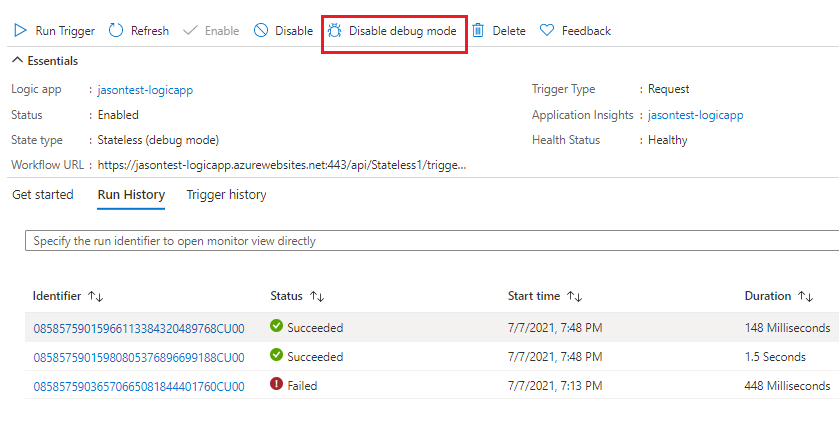
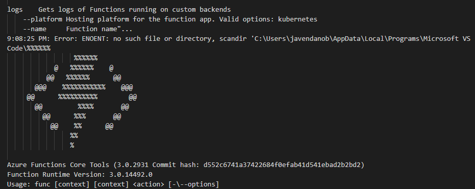
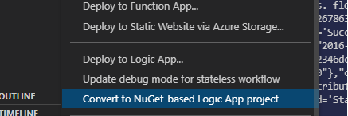
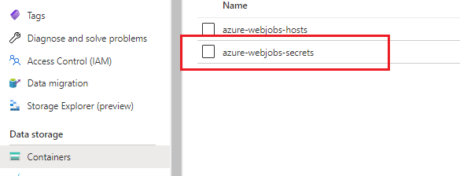
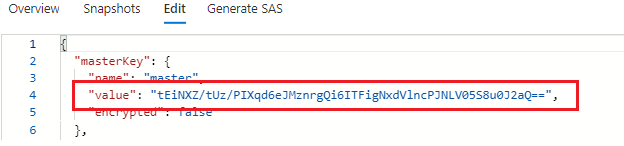
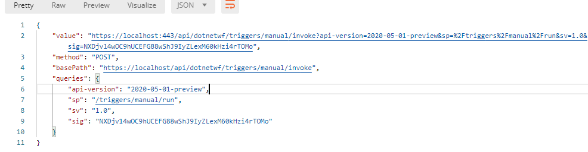

# Logicapp-standard

En el ejemplo se hace uso de funciones stateless y stateful 

Componentes a instalar:
- [azure sdk](https://azure.microsoft.com/en-us/downloads/)
- [Azure Storage Emulator](https://go.microsoft.com/fwlink/?LinkId=717179&clcid=0x409)
- [Azure Account Extention](https://marketplace.visualstudio.com/items?itemName=ms-vscode.azure-account)
- [Azure Function core 3.0.3477](https://github.com/Azure/azure-functions-core-tools/releases/tag/3.0.3477)
- [Azure Logic Apps (standard) extention](https://go.microsoft.com/fwlink/p/?linkid=2143167)
- [Azurite](https://www.npmjs.com/package/azurite) Esta es la version cross-platform del emulador
- [Azure Extension]()
- [Documentación](https://docs.microsoft.com/en-us/azure/logic-apps/single-tenant-overview-compare) Aca se encuentra toda la informacion para el manejo de la herramienta

Documentacion adicional
- [run-anywhere](https://techcommunity.microsoft.com/t5/integrations-on-azure/azure-logic-apps-running-anywhere-runtime-deep-dive/ba-p/1835564)
- [networking](https://techcommunity.microsoft.com/t5/integrations-on-azure/logic-apps-anywhere-networking-possibilities-with-logic-app/ba-p/2105047)
- [app-settings](https://docs.microsoft.com/en-us/azure/logic-apps/edit-app-settings-host-settings?tabs=visual-studio-code)
- [what-is-single-tenent](files/What-is-Single-Tenancy.pdf)
- [overview-single-tenent](files/Overview-Single-tenant.pdf)
- [edit-app-settings](files/edit-app-settings.pdf)
- [parameters](https://docs.microsoft.com/en-us/azure/logic-apps/parameterize-workflow-app?tabs=azure-portal)


Tips:
- Para ejecutar correctamente la aplicacion, tener ejecutado el azure emulator. 

- Desde la extension de Azure en visual code , se pueden realizan las publicaciones.


- Si se desea crear un nuevo workflow, este se puede realizar inicializar desde la extension de azure, de manera que se cuente con la estructura de carpetas necesaria para el trabajo:


- Para la funciones stateless por defecto no registra informacion del log de ejecucion, para esto hay que habilitar el modo debug



- A nivel de Visual code se debe realizar un operacion parecida para validar el historico de ejecucion:
colocar la linea `Workflows.Stateless1.OperationOptions": "WithStatelessRunHistory"`


- Como especifica la documentacion, se pueden usa conectores manejados por azure o incorporados (Built-in), estos ultimos tienen la ventaja que se ejecutan en el mismo espacio de trabajo de la logic app, lo cual incremeta la velocidad de ejecucion.

- Si la logic app (Standard) se detiene, los worlflow creados no son visibles en la plataforma de azure.

- Se tienen menos triggers disponibles en la version standard stateless vs la version de consumo o statefull. A continuacion se presentan imagenes representativas [limitantes](https://docs.microsoft.com/en-us/azure/logic-apps/single-tenant-overview-compare#changed-limited-unavailable-or-unsupported-capabilities)


- Anidamiento de workflows: se permite llamar flujos extentes dentro de otros, permitiendo aplicar patrones de ejecución, tal y como se hace en las funciones de larga duracion. [link](https://docs.microsoft.com/en-us/azure/logic-apps/single-tenant-overview-compare#nested-behavior-differences-between-stateful-and-stateless-workflows)


- Si el proceso de debug genera problemas, se debe validar la versión de Azure Function Core Tool, que corresponda a la referenciada en los enlaces iniciales.



- Estructura de carpetas [link](https://docs.microsoft.com/en-us/azure/logic-apps/edit-app-settings-host-settings?tabs=visual-studio-code#visual-studio-code-project-structure).

- Es importante excluir en alchivo local.settings.json del repositorio, dado que es una archivo de trabajo en el proceso de desarrollo y solo debe estar vigente en modo local y afectan a todos los workflows. Por defecto, cuando se crea el workflow desde la extension de Azure, se adiciona el archivo *.funcignore* con la exclusiones de repositorio recomendadas.


## Contenedor

Para la ejecución en contenedor [link](https://microsoft.github.io/AzureTipsAndTricks/blog/tip311.html) [link2](https://github.com/jaysson1710/logicapps/tree/master/azure-devops-sample)

Para esta ejecución tener en cuenta:

- Especificar el connection-string de la cuenta de almacenamiento en el dockerfile, o manejar archivo de variables .env para un proceso de despliegue y ejecución mas dinámico

- Nota: :shit: si el proyecto tiene varios workflow, en el momento está generando errores en el montaje con docker, se debe validar más a profundidad, para solventar el problema en el presente ejercicio se crean proyectos independientes con node y dotnet en las rutas src3 y src2 respectivamente.

- En el momento del ejercicio se esta trabajando con net core 3.1, en caso de tener instalado net 5.X, se debe desinstalar este para permitir visualizar el diseñador en el IDE.

- Por defecto crea el proyecto en node, por lo que hay que realizar el cambio del tipo de proyecto: click derecho sobre el workspace del pryecto y seleccionar la opcion convertir, para poder trabajar con acciones o triggers personalizados



- En cada carpeta se adiciona un archivo dockerfile con la configuracion requerida para la ejecucion del proyecto.

- La compilacion y ejecucion del contenedor se especifica mas adelante con un ejemplo completo, pero en escencia n hay diferencia con respecto a otras ejecuciones, excepto por la variable de entorno *WEBSITE_HOSTNAME*.

- Ruta de acceso al contenedor: una vez ejecutado el contenedor *docker run ....* proceder al llamad de la URL  http://localhost:**port-run-image**/runtime/webhooks/workflow/api/management/workflows/**name-workflow**/triggers/manual/listCallbackUrl?api-version=2020-05-01-preview&code=**master-key** . 

Especificar :
```
- *port-run-image*: puerto sobre el cual se ejecuta el contenedor.
- *name-workflow*: nombre del workflow a ejecutar. Solo permite un workflow por proyecto.
- *master-key*: clave principal del contenedor asociado en la variable de entorno *AzureWebJobsStorage*
```

- Obtención de master-key sobre el storage: este valor puede no ser generado cuando se ejecuta el contenedor, por lo que se debe hacer el llamado a la url *http://localhost:**port-run-image**/runtime/webhooks/workflow/api/management/workflows/**name-workflow**/triggers/manual/listCallbackUrl?api-version=2020-05-01-preview* con metodo post

- Una vez se realizado el llamado, se crean una serie de carpetas en el storage asociado en: *AzureWebJobsStorage*

- Obtener el valor del master-key contendida en el archivo *host.json*





- Realizar el llamado a *http://localhost:**port-run-image**/runtime/webhooks/workflow/api/management/workflows/**name-workflow**/triggers/manual/listCallbackUrl?api-version=2020-05-01-preview&code=**master-key>**.* especificacion la master-key. Como resultado obtenemos la url destino



- Tomar el campo *value*. *Esta url es el valor generado directamente por la funcion dentro del contenedor, por lo que se debe cambiar el protocolo de comunicacion y el número del puerto al usado en la ejecución de la imagen.*

A continuación esta un ejemplo de los comando usados para la ejecución, proyecto dentro del folder src2 que corresponde al proyecto con dotnet.

```bash
cd src2
dotnet build -c release 
dotnet publish -c release
docker build . -t logicappsampledotnet
docker run -e WEBSITE_HOSTNAME=localhost -p 8081:80 --rm logicappsampledotnet
curl "http://localhost:8081/runtime/webhooks/workflow/api/management/workflows/dotnetwf/triggers/manual/listCallbackUrl?api-version=2020-05-01-preview&code=xxxxxxxxx"
## ejemplo consumo: esta url proviene de la peticion anterior
curl "http://localhost:8081/api/dotnetwf/triggers/manual/invoke?api-version=2020-05-01-preview&sp=%2Ftriggers%2Fmanual%2Frun&sv=1.0&sig=NXDjv14wOC9hUCEFG88wShJ9IyZLexM60kHzi4rTOMo"
```

El siguiente ejemplo se implementa con node, folder src3 que corresponde al proyecto en node.

```bash
cd src3
docker build . -t logicappsamplenode
docker run -e WEBSITE_HOSTNAME=localhost -p 8081:80 --rm logicappsamplenode
curl "http://localhost:8081/runtime/webhooks/workflow/api/management/workflows/stateful1/triggers/manual/listCallbackUrl?api-version=2020-05-01-preview"
## ejemplo consumo: esta url proviene de la peticion anterior
curl "http://localhost:8081/api/dotnetwf/stateful1/manual/invoke?api-version=2020-05-01-preview&sp=%2Ftriggers%2Fmanual%2Frun&sv=1.0&sig=NXDjv14wOC9hUCEFG88wShJ9IyZLexM60kHzi4rTOMo"
```

Una vez invocado el comando de ejecución, se puede visualizar en la consola del IDE, el log, confirmando el funcionamiento correcto de la apliación:

Ejemplo:

```
info: Function.dotnetwf[2]
      Executed 'Functions.dotnetwf' (Succeeded, Id=06035f6b-c8a7-4b81-9d6f-aa1c093ef4c3, Duration=2131ms)
info: Host.Triggers.Workflows[202]
      Workflow run ends. flowName='dotnetwf', flowId='27bd2346dc764f8e8682afc8bdfc5ae2', flowSequenceId='08585757572181258470', flowRunSequenceId='08585757553985531521605972675CU00', correlationId='4b2b260b-526a-4805-8c2b-c369ad2eb71a', extensionVersion='1.0.0.0', siteName='UNDEFINED_SITE_NAME', slotName='', status='Succeeded', statusCode='', error='', durationInMilliseconds='2760', clientTrackingId='08585757553985531521605972675CU00', properties='{"$schema":"2016-06-01","startTime":"2021-07-09T17:24:46.9261336Z","endTime":"2021-07-09T17:24:49.7986397Z","status":"Succeeded","resource":{"workflowId":"27bd2346dc764f8e8682afc8bdfc5ae2","workflowName":"dotnetwf","runId":"08585757553985531521605972675CU00","originRunId":"08585757553985531521605972675CU00"},"correlation":{"clientTrackingId":"08585757553985531521605972675CU00"}}', sequencerType='Linear', flowScaleUnit='cu00', platformOptions='RunDistributionAcrossPartitions, RepetitionsDistributionAcrossSequencers, RunIdTruncationForJobSequencerIdDisabled, RepetitionPreaggregationEnabled', kind='Stateful', runtimeOperationOptions='None', usageConfigurationName='', activityId='da893135-0a07-411e-a806-62f406cb64d2'.
```

## PipeLines

Para el proceso de depliegue de la logic app desde Azure DevOps

- [Release](https://docs.microsoft.com/en-us/azure/logic-apps/set-up-devops-deployment-single-tenant-azure-logic-apps?tabs=azure-devops#release-to-azure)

Ejemplo del pipeline de despliegue: [pipe](azure-pipelines.yml)

A tener encuenta.
- Comprimir el paquete a despliegar, con toda la estructura de carpetas requerida.

- Se usa la tarea de despliegue de funciones, en el modo clasico no se puede realizar esta operacion (a la fecha) dado que no da la opcion **appType: 'workflowapp'**

Ejemplo de la tarea

```yml
- task: AzureFunctionApp@1
  displayName: 'Azure functions app deploy'
  inputs:
    azureSubscription: '$(azureSubscription)'
    appType: 'workflowapp'
    appName: $(functionAppName)
    package: '$(Build.ArtifactStagingDirectory)/$(Build.BuildId).zip'
    deploymentMethod: 'zipDeploy'
```

